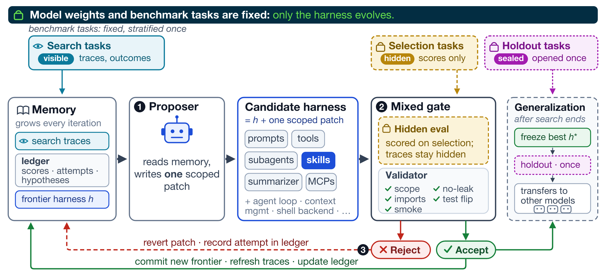

# StarHarness

Use StarHarness to improve an agent harness while keeping model weights fixed. A proposer reviews
failures from a search split and edits prompts, tools, skills, or agent-loop code. StarHarness tests
each patch on a separate selection split and commits patches that improve its score. After the
search ends, StarHarness evaluates the winning commit on held-out tasks.



You can connect another benchmark through [`BenchmarkAdapter`](benchmarks/base.py). The included
AutomationBench Finance and ITBench SRE adapters show the same search, selection, and holdout
workflow with different evaluators and agent environments.

## Repository layout

- `evolving_harness.py` runs proposal, validation, evaluation, and rollback.
- `stratify_tasks.py` builds compact search, selection, and holdout splits from baseline traces.
- `omp_wrapper.py` runs [oh-my-pi](https://github.com/can1357/oh-my-pi) as the proposer.
- `benchmarks/base.py` defines the adapter contract.
- `benchmarks/automationbench` contains the Finance adapter, evaluator, prompts, and splits.
- `benchmarks/itbench` contains the ITBench SRE adapter, evaluator, prompts, and splits.
- `vendor/stirrup` contains the initial harness that the proposer may edit.
- `vendor/automationbench` contains the simulated SaaS environment and assertion library.
- `docs/ADDING_A_BENCHMARK.md` explains how to add an adapter.

The repository excludes run outputs, traces, credentials, and private datasets.

## Requirements

- Python 3.13
- Git
- [uv](https://docs.astral.sh/uv/)
- [oh-my-pi](https://github.com/can1357/oh-my-pi), exposed as `omp` or through `OMP_BIN`
- An API key or an OpenAI-compatible model endpoint

## Install

```bash
git clone <your-fork-url> StarHarness
cd StarHarness
uv sync
cp .env.example .env
```

Add `OPENAI_API_KEY` to `.env`, or set `AGENT_BASE_URL` and the credentials required by your
endpoint. StarHarness uses Git commits as frontier checkpoints, so run it from a clean checkout.
If you downloaded a source archive, initialize a repository and create one commit before running
the evolution loop.

## Run the Finance example

The evaluator and proposer make model calls. Check your endpoint and budget before running them.
Start with one Finance task and a five-turn cap:

```bash
uv run python -m benchmarks.automationbench.run_eval \
  --tasks 4001 \
  --max-turns 5 \
  --max-concurrency 1 \
  --name smoke
```

Run one evolution iteration with one search task and one selection task:

```bash
uv run python evolving_harness.py \
  --benchmark automationbench \
  --run-name finance-demo \
  --scenarios 4001 \
  --selection-scenarios 4005 \
  --iterations 1 \
  --concurrency 1 \
  --no-held-out
```

Remove the two scenario overrides to use the checked-in Finance splits.

## Run the ITBench example

ITBench evaluates root-cause diagnosis over offline Kubernetes incident snapshots. Its public
dataset is about 31 GB, so set `ITBENCH_DATA` to a persistent location with enough free space.
The evaluator downloads only the requested scenario for a smoke run:

```bash
uv run python -m benchmarks.itbench.run_eval \
  --scenario Scenario-6 \
  --repeats 1 \
  --max-turns 5 \
  --max-concurrency 1 \
  --name itbench-smoke
```

Set `JUDGE_MODEL` and its API credentials to use model-assisted entity normalization. Without a
judge model, the evaluator uses its deterministic matcher.

Run one evolution iteration with one search scenario and one selection scenario:

```bash
uv run python evolving_harness.py \
  --benchmark itbench \
  --run-name itbench-demo \
  --scenarios Scenario-6 \
  --selection-scenarios Scenario-11 \
  --iterations 1 \
  --concurrency 1 \
  --no-held-out
```

Remove the two scenario overrides to use the checked-in ITBench splits.

| Adapter | Search | Selection | Holdout | Metric |
|---|---:|---:|---:|---|
| AutomationBench Finance | 30 | 20 | 50 | Programmatic assertion score |
| ITBench SRE | 5 | 5 | 30 | Precision at full recall |

The prior ITBench study used a 10-scenario development set. StarHarness splits those scenarios
into five search and five selection tasks, then reserves the other 30 public scenarios for
holdout. For a new study, run `stratify_tasks.py` on a full baseline and check the failure-mode
balance before replacing the checked-in split.

## Create stratified task splits

Build the partition before evolution. Run the baseline harness on each reproducible task, then
create a JSON manifest with one record per task:

```json
{
  "tasks": [
    {
      "task_id": "task-001",
      "reproducible": true,
      "baseline_score": 0.25,
      "verifier_pass_rate": 0.60,
      "trace_path": "runs/baseline/task-001/trace.log"
    }
  ]
}
```

The manifest needs at least three reproducible tasks. Trace paths resolve from the manifest's
directory. The helper sends each trace to your configured model endpoint and uses one worker call
per task. Check the traces for secrets and set a budget before running it. Run the helper from the
repository root:

```bash
uv run python stratify_tasks.py \
  --manifest baseline_tasks.json \
  --output-dir stratification_runs/finance \
  --max-wave 8
```

OMP assigns one isolated subagent to each baseline trace. Each worker labels the causal failure
mode. The parent groups matching labels and chooses the smallest search and selection sets that
match failure-mode, score, and verifier-pass distributions. The helper keeps the evolution pool
at or below half of the reproducible tasks and puts the rest in holdout. In StarHarness,
`selection` is the hidden validation split.

Set fixed sizes when the benchmark protocol requires them:

```bash
uv run python stratify_tasks.py \
  --manifest baseline_tasks.json \
  --output-dir stratification_runs/finance \
  --search-size 10 \
  --selection-size 10
```

The helper writes adapter-compatible `search_scenarios.json`, `selection_scenarios.json`, and
`holdout_scenarios.json`. Review `stratification_report.json` before copying the split files into
an adapter. Keep `stratification.json`, selection traces, and holdout traces outside the proposer
context during evolution. Git ignores `stratification_runs/` because its reports cover all three
splits.

### Optional per-trace subagents

The default `inline` mode asks one proposer to inspect all search traces in its context. For a
larger analysis pass, ask the proposer to spawn one isolated worker per search trace and combine
their reports before it edits the harness:

```bash
uv run python evolving_harness.py \
  --benchmark itbench \
  --run-name itbench-subagents \
  --iterations 1 \
  --trace-analysis subagents \
  --trace-subagent-wave 8
```

Each worker receives one search scenario and reports its causal errors and proposed intervention.
The parent proposer checks coverage, compares reports across scenarios, and makes one candidate
edit. Selection and held-out evidence remain hidden. This mode costs more and takes longer because
it makes one worker call per search trace. `--trace-subagent-wave` limits how many workers run at
once.

## Evolution sequence

1. Measure the current harness on the search and selection splits.
2. Give the proposer search traces, scores, and failure evidence.
3. Capture the proposer edits as a Git diff.
4. Reject edits outside the adapter scope or changes to protected benchmark files.
5. Check imports and run a one-task smoke evaluation.
6. Score the candidate on the hidden selection split.
7. Commit an improvement or restore the previous frontier.
8. Score the final frontier on the held-out split.

Each adapter protects its grader, task loader, and split definitions. The proposer can read search
answers for diagnosis. The agent under test receives only the benchmark's normal task and
observation surface.

## Add a benchmark

Follow [Adding a benchmark](docs/ADDING_A_BENCHMARK.md). You will implement the adapter contract,
an evaluator that writes `summary.json`, proposal templates, and three task splits. The guide also
covers edit boundaries, trace handling, result validation, and adapter tests.

## Security

The proposer executes model-generated code with your local user permissions. Use a dedicated
checkout or sandbox and keep unrelated credentials out of the process environment.

## Contributing and licensing

Read [CONTRIBUTING.md](CONTRIBUTING.md) before opening a pull request. StarHarness uses the MIT
license. Third-party software and dataset notices are in [NOTICE.md](NOTICE.md).
